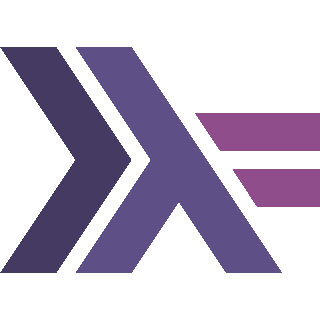
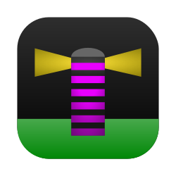

# Project Lighthouse

This GitHub organization hosts a number of Open Source projects for Project Lighthouse, the light installation at Kiel University.

## Client SDKs

Build Lighthouse apps and games in your language of choice.

  <table>
    <tr>
      <th>
        

           
          Python
        

      </th>
      <th>
        

           
          TypeScript
        

      </th>
      <th>
        

           
          Rust
        

      </th>
      <th>
        

           
          Go
        

      </th>
    </tr>
    <tr>
      <td>
        <a href="https://github.com/ProjectLighthouseCAU/pyghthouse">Pyghthouse</a>
      </td>
      <td>
        <a href="https://github.com/ProjectLighthouseCAU/nighthouse">Nighthouse</a>
      </td>
      <td>
        <a href="https://github.com/ProjectLighthouseCAU/lighthouse-rust">lighthouse-rust</a>
      </td>
      <td>
        <a href="https://github.com/ProjectLighthouseCAU/lighthouse-go">lighthouse-go</a>
      </td>
    </tr>
    <tr>
      <td>
        <a href="https://github.com/fwcd/phare">Phare*</a>
      </td>
      <td>
        <a href="https://github.com/H1ghbre4k3r/lighthouse.js">LighthouseJS*</a>
      </td>
      <td></td>
      <td></td>
    </tr>
    <tr>
      <td></td>
      <td></td>
      <td></td>
      <td></td>
    </tr>
    <tr>
      <th>
        

           
          Java
        

      </th>
      <th>
        

           
          Swift
        

      </th>
      <th>
        

           
          Haskell
        

      </th>
      <th>
        

           
          C#
        

      </th>
    </tr>
    <tr>
      <td>
        <a href="https://github.com/ProjectLighthouseCAU/jighthouse">jighthouse</a>
      </td>
      <td>
        <a href="https://github.com/ProjectLighthouseCAU/lighthouse-swift">lighthouse-swift</a>
      </td>
      <td>
        <a href="https://github.com/ProjectLighthouseCAU/lighthouse-haskell">lighthouse-haskell</a>
      </td>
      <td>
        <a href="https://github.com/jnccd/see-clearly-lighthouse">SeeClearlyLighthouse*</a>
      </td>
    </tr>
  </table>

> [!NOTE]
> Libraries marked with an asterisk are inofficial and maintained by external contributors.

## Frontend

Official frontends for Project Lighthouse.

  <table>
    <thead>
      <tr>
        <th>
          

             
            LUNA
          

        </th>
      </tr>
    </thead>
    <tbody>
      <tr>
        <td>
          

            <a href="https://github.com/ProjectLighthouseCAU/luna"> The unified web frontend</a>
          

        </td>
      </tr>
    </tbody>
  </table>

